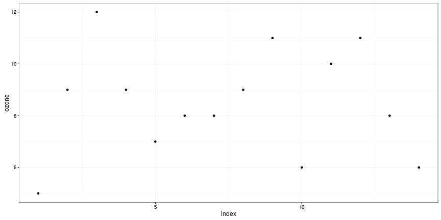
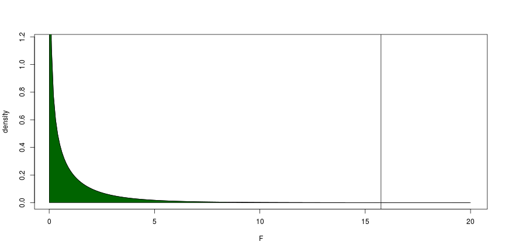
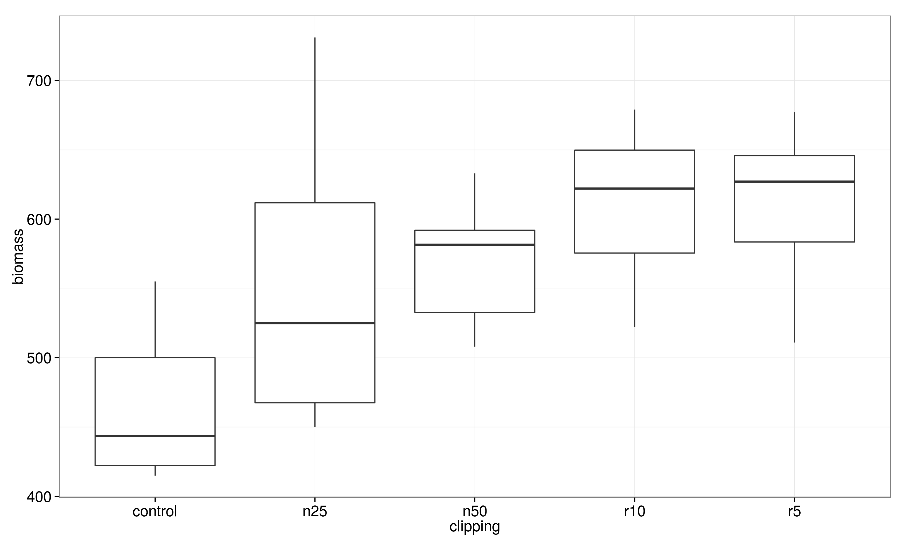
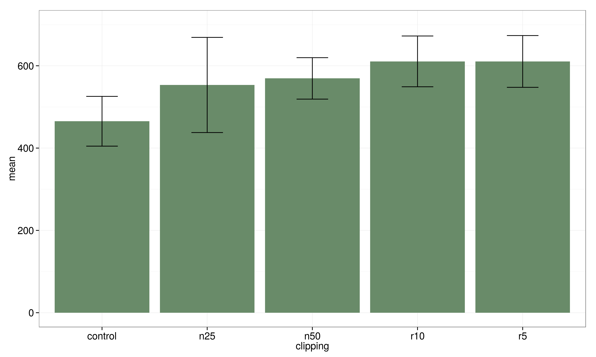
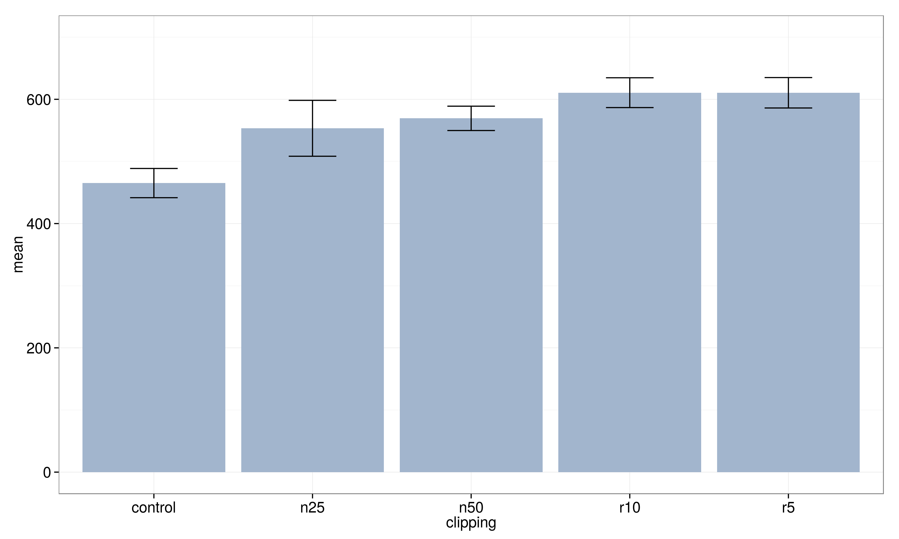

<style>
strong {
  font-weight: bold;
  color: red;
  font-size: 115%
}
</style>


--- .segue bg:grey

# Recap


---


## Recap

You should know now:
>  - the command  `t.test()` and the different kinds of usage
>  - that `y ~ x` in R mean *y dependent on x* (formula syntax)
>  - that R can roll dice for you (as one example for random number generator)
 
 
 
---


---


## Exercises

For the `babies` data set, the variable `age` contains the recorded mom's age and `dage` contains the dad's age for several different cases in the sample. Do a significance test of the null hypothesis of equal ages against a one-sided alternative that the dads are older in the sampled population. 

- install the package UsingR (you may check if the package is already installed) 
- do the respective t-test
- redo the test assuming equal variances! How do the results differ? Would this assumption be appropriate?
  

--- .segue bg:grey

# Anova


---

## Anova

- a technique we use when all explanatory variables are categorical (factor)
- if there is one factor with three or more levels we use one-way ANOVA (only two levels: t-test should be preferred, would give exactly the same answer since with 2 levels F = t^2)
- for more factors there there is two-way, three-way anova
- central idea is to compare two or more means by comparing variances

---

## Example Data

A data frame with 14 observations on 2 variables.

Variable|content
--------|--------
 ozone: | athmospheric ozone concentration 
 garden: |  garden id 


---

## Example Data


Var|  1 |  2 |  3 |  4 |  5 |  6 |  7 |  8 |  9 | 10 | 11 | 12 | 13 | 14  
------|----|----|----|----|----|----|----|----|----|----|----|----|----|----
ozone  |  9 |  7 |  6 |  8 |  5 | 11 |  9 | 11 |  9 |  6 | 10 |  8 |  8 | 12 
garden | a  |  a |  a |  b |  a |  b |  b |  b |  b |  a |  b |  a |  a |  b 


Source: M. Crawley, The R-Book

---

## Exercise

- read in the respective data file *anova.txt* using the `read.table()` command


---

## Solution


```r
gardens <- read.table("session5dat/gardens2.txt", header = T)
head(gardens)
```

```
##   ozone garden index
## 1     6      a    10
## 2     8      a     7
## 3     5      a     1
## 4     9      a     4
## 5     7      a     5
## 6     8      a     6
```


---

## Total Sum of Squares

- first we plot the values 




---

## Total Sum of Squares

- there is a lot of scatter, indicating that the variance in ozone is large
- to get a feel for the overall variance we plot the overall mean (8.5) and indicate each of the residuals by a vertical line


---

## Total Sum of Squares


---

## Total Sum of Squares

- we refer to this overall variation as the total sum of squares, SSY or TSS

$$SSY = \sum(y-\bar{y})^2$$


---

## Total Sum of Squares

- here we have $$ SSY = 55.5 $$


---

## Group means

- now instead of fitting the overall mean, let us fit the individual garden means


---

## Group means

- now instead of fitting the overall mean, let us fit the individual garden means

garden | mean
-------|------
a | 7
b | 10


---

## Group means

- Garden A: black
- Garden B: red


---

## Group means


- now we see that the mean ozone concentration is substantially higher in garden B
- the aim of ANOVA is to determine
  - whether it is significantly higher or
  - whether this kind of difference could come by chance alone


  
---

---


## Error Sum of Squares

  When the means are significantly different then the sum of squares
computed from the individual garden means will be smaller than
the sum of squares computed from the overall mean.

  - we define the new sum of squares as the error sum of squares (error in the sense of *redidual*) $$ SSE = \sum(y_{garden A}-\bar{y}_{garden A})^2+\sum(y_{garden B}-\bar{y}_{garden B})^2 $$
  

---


## Error Sum of Squares


- here we have $$ SSE = 24.0 $$


---


## Treatment Sum of Squares

- then the component of the variation that is explained by the difference (i.e. explained by the predictor) of the means is called the treatment sum of sqares SSA 
- analysis of variance is based on the notion that we break down the total sum of squares into useful and informative components

$$ SSY = SSE + SSA $$ 

where

- SSA = explained variation 
- SSE = unexplained variation


---


## Anova Table


Source | Sum of squares | Degrees of freedom | Mean square | F ratio
-------|----------------|--------------------|-------------|---------
Garden |  $31.5$        | $1$                |  $31.5$     |  $15.75$
Error  |  $24.0$        | $12$               |  $s^2=2.0$  |   
Total  |  $55.5$        | $13$               |             |      


---


## F-Test

- now we need to test whether an F ratio of 15.75 is large or small
  - we can use a table or software package
  - I use here R to calculate the cumulative probability


```r
1 - pf(15.75,1,12)
```

```
## [1] 0.001864103
```


---


## F-Test





---


## Anova in R

- in R we use the `lm()` command and
- the formula syntax `a ~ b`
- we assign the result to a variable


```r
mm <- lm(ozone ~ garden, data = gardens)
mm
```

```
## 
## Call:
## lm(formula = ozone ~ garden, data = gardens)
## 
## Coefficients:
## (Intercept)      gardenb  
##           7            3
```


---


## Anova in R


```r
summary(mm)
```

```
## 
## Call:
## lm(formula = ozone ~ garden, data = gardens)
## 
## Residuals:
##    Min     1Q Median     3Q    Max 
##     -2     -1      0      1      2 
## 
## Coefficients:
##             Estimate Std. Error t value Pr(>|t|)    
## (Intercept)   7.0000     0.5345  13.096 1.82e-08 ***
## gardenb       3.0000     0.7559   3.969  0.00186 ** 
## ---
## Signif. codes:  0 '***' 0.001 '**' 0.01 '*' 0.05 '.' 0.1 ' ' 1
## 
## Residual standard error: 1.414 on 12 degrees of freedom
## Multiple R-squared:  0.5676,	Adjusted R-squared:  0.5315 
## F-statistic: 15.75 on 1 and 12 DF,  p-value: 0.001864
```


---


## Anova in R


```r
anova(mm)
```

```
## Analysis of Variance Table
## 
## Response: ozone
##           Df Sum Sq Mean Sq F value   Pr(>F)   
## garden     1   31.5    31.5   15.75 0.001864 **
## Residuals 12   24.0     2.0                    
## ---
## Signif. codes:  0 '***' 0.001 '**' 0.01 '*' 0.05 '.' 0.1 ' ' 1
```


---


## Anova - Visualization 

- there are two traditional ways of plotting the results of ANOVA
- box-and-whisker plots
- barplots with error bars

---


## Anova - Visualization 




---


## Anova - Visualization 


---


## Anova - Visualization 




---


## Anova - Visualization 




